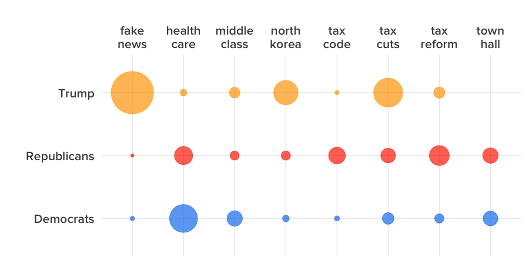
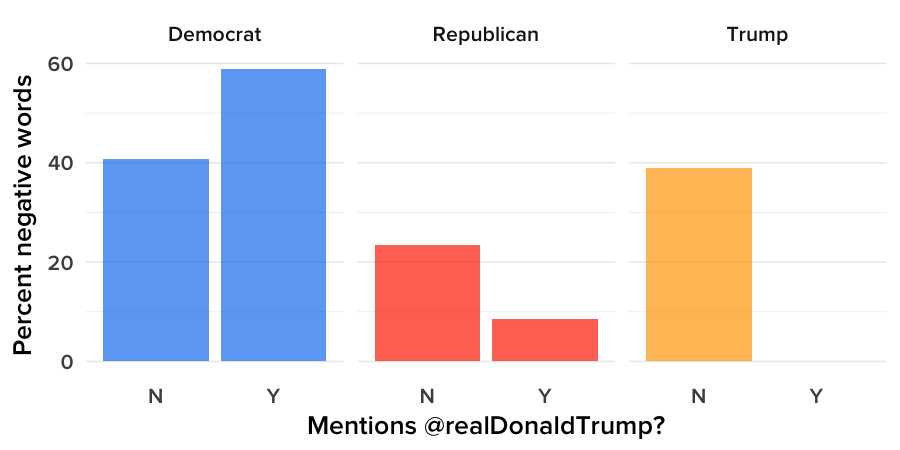

# How Trump's Tweets Shaped A Year In Politics

```{r setup, include=FALSE}
library(knitr)
opts_chunk$set(out.width="900px", dpi=300)
```

Data and [R](https://www.r-project.org/) code for the analysis supporting this [Jan. 23, 2018 BuzzFeed News post](https://www.buzzfeed.com/peteraldhous/trump-twitter-wars) on political Twitter in the first year of Donald Trump's presidency. Supporting files are in [this GitHub repository](https://github.com/BuzzFeedNews/2018-01-trump-twitter-wars).

### Data

We gathered data on tweets from Donald Trump's personal Twitter account, and for the official accounts of all members of Congress, using the [Twitter API](https://developer.twitter.com/en/docs/api-reference-index). We identified congressional accounts from data maintained by [theunitedstates.io](https://theunitedstates.io/), which includes Twitter handles, and joined this data to the tweets data to identify members by party. Given the limit of 3,200 tweets when pulling from users' timelines, we harvested data multiple times over the course of the year to obtain data from the most active accounts.

On Jan. 20, 2018 at 3 p.m. Eastern time, we also gathered basic information for each account from the Twitter API, including follower counts.

### Setting up

Required packages, color palettes, and regular expressions to use for parsing tweets.

```{r, results="hide", warning=FALSE, message=FALSE}
# load required packages
library(tidytext)
library(readr)
library(dplyr)
library(tidyr)
library(ggplot2)
library(lubridate)
library(stringr)
library(wordcloud)
library(DT)

# palette for Congressional Democrats and Republicans, plus Trump
party_pal <- c("#1482EE","#FF3300", "#FFA500")

# palettes for wordclouds
dem_pal <- c("#47B5FF", "#1482EE", "#004FBB")
rep_pal <-  c("#FF6633", "#FF3300", "#CC0000")
trump_pal <-  c("#FFD833", "#FFA500", "#CC7200")

# regexes for parsing tweets using the tidytext package
replace_reg <- "https?://[^\\s]+|&amp;|&lt;|&gt;|\\bRT\\b"
unnest_reg <- "([^A-Za-z_\\d#@']|'(?![A-Za-z_\\d#@]))"
```

### Load and process data

The two Independent Senators, Bernie Sanders of Vermont and Angus King of Maine, caucus with the Democrats. So we assigned them as Democrats for this analysis, then created new variables for `time` (US Eastern) and `category`, to group by party and Trump.

```{r, results="hide", warning=FALSE, message=TRUE}
tweets <- data_frame()

files <- list.files("data/tweets")
for (f in files) {
  tmp <- read_csv(paste0("data/tweets/",f), col_types = cols(
    .default = col_character(),
    favorited = col_logical(),
    favoriteCount = col_integer(),
    retweetCount = col_integer(),
    created = col_datetime(format = ""),
    truncated = col_logical(),
    isRetweet = col_logical(),
    retweeted = col_logical(),
    timestamp = col_datetime(format = ""),
    us_timestamp = col_datetime(format = ""),
    date = col_date(format = ""),
    birthday = col_date(format = "")
    ))
  tweets <- bind_rows(tweets,tmp)
}

# assign Independent Senators to Democrats
tweets$party <- gsub("Independent","Democrat", tweets$party)

tweets <- tweets %>%
  mutate(time = hour(us_timestamp) + minute(us_timestamp)/60,
         category = ifelse(screenName == "realdonaldtrump","Trump",party))

latest <- tweets %>%
  group_by(screenName) %>%
  summarise(latest = max(date))
```
### When did they tweet?

```{r, eval=FALSE, warning=FALSE, message=FALSE}
ggplot(tweets, aes(y=time, x= category, fill = category)) +
  geom_rect(aes(xmin = 0, xmax = 4, ymin = 6, ymax = 9),
            fill="gray95", alpha = 0.1) +
  scale_y_continuous(limits = c(1,24), 
                      breaks = c(6,12,18), 
                      labels = c("6am","Noon","6pm")) +
  scale_fill_manual(values = party_pal, guide = FALSE) +
  scale_x_discrete(labels = c("Democrat","Republican","Trump")) +
  geom_violin(size = 0, alpha = 0.7) +
  xlab("") +
  ylab("") +
  annotate("text", 
           x = 0.4,
           y = 7.5,
           label = "Fox & Friends",
           color = "gray60",
           size = 5,
           family = "ProximaNova-Semibold") +
  geom_hline(yintercept=seq(3, 24, by = 3), color = "gray", size = 0.1) +
  coord_flip() +
  theme_minimal(base_size = 16, base_family = "ProximaNova-Semibold") +
  theme(panel.grid = element_blank())
```


### Which Twitter accounts did they interact with most often?

We isolated Twitter handles from all tweets, and calculated how often each account was mentioned (including retweets) by each of Trump, Democrats, and Republicans, as a percentage of all mentions.

```{r, warning=FALSE, message=FALSE}
handles <- tweets %>%
  mutate(text = tolower(str_replace_all(text, replace_reg, ""))) %>%
  unnest_tokens(word, text, token = "regex", pattern = unnest_reg) %>%
  # select twitter handles, removing any isolated @
  filter(grepl("@",word) & word != "@") %>% 
  # clean possessives
  mutate(word = gsub("'s","", word)) %>%
  group_by(category) %>%
  count(word)
  
handle_freqs <- handles %>%
  left_join(handles %>% 
              group_by(category) %>% 
              summarise(total = sum(n))) %>%
  mutate(percent = round(n/total*100,2)) %>%
  arrange(-percent)

# select the top 100 accounts for each group and format numbers
top_handles <- handle_freqs %>%
  top_n(100) %>%
  mutate(total = format(total, big.mark=","),
         n = format(n, big.mark=","))
```

#### Trump
```{r, warning=FALSE, message=FALSE}
# Trump
datatable(subset(top_handles, category=="Trump"), rownames = FALSE, colnames=c("category","account","mentions","total","percent"))
```

#### Democrats
```{r, warning=FALSE, message=FALSE}
# Democrats
datatable(subset(top_handles, category=="Democrat"), rownames = FALSE, colnames=c("category","account","mentions","total","percent"))
```

#### Republicans

```{r, warning=FALSE, message=FALSE}
# Republicans
datatable(subset(top_handles, category=="Republican"), rownames = FALSE, colnames=c("category","account","mentions","total","percent"))
```

### When did Trump mention *Fox & Friends*?

Trump clearly loves *Fox & Friends*, but how many of his mentions came during his favorite cable news show's 6 a.m. to 9 a.m. time slot?

```{r, warning=FALSE, message=FALSE}
foxandfriends <- tweets %>%
  filter(category == "Trump") %>%
  mutate(timeslot = ifelse((time > 6 & time < 9),"On air","Off air"),
         text = tolower(str_replace_all(text, replace_reg, ""))) %>%
  unnest_tokens(word, text, token = "regex", pattern = unnest_reg) %>%
  filter(grepl("@foxandfriends",word)) %>% 
  # clean possessives
  mutate(word = gsub("'s","", word)) %>%
  group_by(category,timeslot) %>%
  count(word)

datatable(foxandfriends, rownames = FALSE, height = 150, colnames = c("category","time slot","handle","tweets"), options = list(dom = "t"))
```


### How often did Democrats and Republicans interact with @realDonaldTrump and @POTUS?

We calculated the frequency with which congressional Democrats mentioned Trump's personal and official Twitter accounts (including retweets), as a percentage of all their mentions.

```{r, warning=FALSE, message=FALSE}
# Democrat and Republican mentions of @realdonaldtrump
rdt_mentions <- top_handles %>%
  filter(category !="Trump" & (word=="@realdonaldtrump" | word=="@potus"))
rdt_mentions$word <- gsub("@realdonaldtrump","@realDonaldTrump", rdt_mentions$word)
rdt_mentions$word <- gsub("@potus","@POTUS", rdt_mentions$word)
```

```{r, eval=FALSE, warning=FALSE, message=FALSE}
#chart 
ggplot(rdt_mentions, aes(x=word, y=percent, fill=category)) +
  geom_bar(stat="identity", alpha = 0.7) +
  facet_wrap(~category, ncol=1) +
  scale_fill_manual(values = party_pal, guide = FALSE) +
  theme_minimal(base_size = 16, base_family = "ProximaNova-Semibold") +
  theme(panel.grid.major.y = element_blank(),
        panel.grid.minor.y = element_blank()) +
  xlab("") +
  ylab("Percent of mentions") +
  coord_flip()

```


### What did they tweet about?

We split the text of original tweets, excluding retweets, into word pairs, or bigrams, filtering out any bigrams containing stop words from the [tidytext](https://cran.r-project.org/web/packages/tidytext/vignettes/tidytext.html) R package. Then we calculated the frequency of each bigram used by Trump, Democrats, and Republicans as a percentage of all the bigrams each used. The chart below shows the results for the three most common bigrams used by each: "Health care" made the top three for both congressional Democrats and Republicans, but not for Trump. 

```{r, warning=FALSE, message=FALSE}

# bigrams
bigrams <- tweets %>% 
  filter(isRetweet == FALSE) %>%
  mutate(text = str_replace_all(text, replace_reg, "")) %>%
  unnest_tokens(bigram, text, token = "ngrams", n = 2) %>%
  separate(bigram, into = c("first","second"), sep = " ", remove = FALSE) %>%
  # remove stop words from tidytext package 
  anti_join(stop_words, by = c("first" = "word")) %>%
  anti_join(stop_words, by = c("second" = "word")) %>%
  filter(str_detect(first, "[a-z]"),
         str_detect(second, "[a-z]")) %>%
  group_by(category) %>%
  count(bigram) %>%
  arrange(-n) 

bigram_freqs <- bigrams %>% 
  left_join(bigrams %>% 
              group_by(category) %>% 
              summarise(total = sum(n))) %>%
  mutate(percent = n/total*100) %>%
  arrange(-percent)

# get the top 3 bigrams for each of Trump, Republicans, and filter for those bigrams only
top_bigrams <- bigram_freqs %>%
  top_n(3) %>%
  ungroup() %>%
  select(bigram) %>%
  unique()

top_bigram_freqs <- bigram_freqs %>%
  semi_join(top_bigrams) %>%
  mutate(bigram = str_replace_all(bigram, " " , "\n"))
```

```{r, eval=FALSE, warning=FALSE, message=FALSE}
# chart
ggplot(top_bigram_freqs, aes(x=category, 
                             y=bigram,
                             color = category, 
                             size = percent)) +
  geom_point(alpha = 0.7) +
  scale_y_discrete(position = "right") +
  scale_color_manual(values = party_pal, guide = FALSE) +
  scale_size_area(max_size = 25, guide = FALSE) +
  theme_minimal(base_size = 16, base_family = "ProximaNova-Semibold") +
  xlab("") +
  ylab("") +
  coord_flip()
```



The wordclouds below show the top 50 bigrams used by each of Trump, Republicans, and Democrats.

#### Trump
```{r, warning=FALSE, message=FALSE}
trump_bigram_freqs <- bigram_freqs %>% 
  filter(category == "Trump")

wordcloud(trump_bigram_freqs$bigram, 
          trump_bigram_freqs$n, 
          family = "ProximaNova-Semibold", 
          max.words = 50,
          random.order = FALSE,
          colors = trump_pal)
```

#### Republicans
```{r, warning=FALSE, message=FALSE}
rep_bigram_freqs <- bigram_freqs %>% 
  filter(category == "Republican")

wordcloud(rep_bigram_freqs$bigram, 
          rep_bigram_freqs$n, 
          family = "ProximaNova-Semibold", 
          max.words = 50,
          random.order = FALSE,
          colors = rep_pal)
```

#### Democrats

```{r, warning=FALSE, message=FALSE}
dem_bigram_freqs <- bigram_freqs %>% 
  filter(category == "Democrat")

wordcloud(dem_bigram_freqs$bigram, 
          dem_bigram_freqs$n, 
          family = "ProximaNova-Semibold", 
          max.words = 50,
          random.order = FALSE,
          colors = dem_pal)
```

### Who tweeted most often?

We counted all tweets, including retweets, for each member of Congress, and for Trump. The most profilic tweeter was Pramila Jayapal, a Democrat who represents Washington's 7th district. Trump, with more than 2,500 tweets in his first year in office, ranked 30th.

```{r, warning=FALSE, message=FALSE}
tweet_counts <- tweets %>%
  group_by(screenName, first_name, last_name, category) %>%
  count() %>%
  arrange(-n) %>%
  mutate(name = paste0(first_name," ",last_name),
         name = ifelse(name == "NA NA", "Donald Trump",name)) %>%
  ungroup() %>%
  select(name,screenName,category,n) %>%
  mutate(n = format(n, big.mark=","))

datatable(tweet_counts, colnames = c("rank","name","screenname","category","tweets"))
```

### What was the emotional content of their tweets, and how did that change when they mentioned @realDonaldTrump?

We ran a sentiment analysis on original tweets only, excluding retweets, using the [lexicon](https://www.cs.uic.edu/~liub/FBS/sentiment-analysis.html) developed by [Bing Lui](https://www.cs.uic.edu/~liub/) of the University of Illinois at Chicago and colleagues. When matching words in the tweets to the lexicon's list of words linked positive or negative emotions, we filtered out a set of custom stop words: "Trump," classed as positive in this lexicon, obviously had to be removed; "critical" and "issue(s)" are classed as negative in this lexicon, but are used differently by politicians. Values for negative words are shown as percentages of all positive and negative words.

```{r, warning=FALSE, message=FALSE}
# load lexicon from https://www.cs.uic.edu/~liub/FBS/sentiment-analysis.html
bing <- get_sentiments("bing")

# custom stop words, to be removed from analysis
custom_stop_words <- data_frame(word = c("trump","critical","issues","issue"))

# sentiment by mentioning trump or not
sentiments_trump_mentions <- tweets %>%
  filter(isRetweet == FALSE) %>%
  mutate(trump_mention = ifelse(grepl("@realdonaldtrump",text), "Y", "N"),
         text = str_replace_all(text, replace_reg, "")) %>%
  unnest_tokens(word, text, token = "regex", pattern = unnest_reg) %>%
  filter(str_detect(word, "[a-z]")) %>%
  # match to lexicon and remove custom stop words
  inner_join(bing, by = "word") %>%
  anti_join(custom_stop_words)

sentiments_counts <- sentiments_trump_mentions %>%
  group_by(category,trump_mention) %>%
  count(sentiment) %>%
  arrange(-n)

negative_freqs <- sentiments_counts %>%
  left_join(sentiments_counts %>% 
              group_by(category,trump_mention) %>% 
              summarise(total = sum(n))) %>%
  mutate(percent = round(n/total*100,2)) %>%
  filter(sentiment == "negative")
```

```{r, eval=FALSE, warning=FALSE, message=FALSE}
ggplot(negative_freqs, aes(x=trump_mention, y=percent, fill=category)) +
  geom_bar(stat="identity", alpha=0.7) +
  facet_wrap(~category, nrow=1) +
  scale_fill_manual(values = party_pal, guide = FALSE) +
  theme_minimal(base_size = 20, base_family = "ProximaNova-Semibold") +
  theme(panel.grid.major.x = element_blank(),
        panel.grid.minor.x = element_blank()) +
  xlab("Mentions @realDonaldTrump?") +
  ylab("Percent negative words")
```



### On which days did Democrats' and Republicans' tweets contain the most negative words?

We excluded Trump from this analysis, because his tweets contained too few emotionally significant words on any single day to give meaningful results. For both congressional Democrats and Republicans, tweets were most negative immediately after the far-right extremist violence in Charlottesville, Virginia, on Aug. 12, 2017. They were least negative on holidays including Independence Day, Christmas, and Thanksgiving.

```{r, warning=FALSE, message=FALSE}

sentiments <- tweets %>%
  filter(isRetweet == FALSE,
         category != "Trump") %>%
  mutate(text = str_replace_all(text, replace_reg, "")) %>%
  unnest_tokens(word, text, token = "regex", pattern = unnest_reg) %>%
  filter(str_detect(word, "[a-z]")) %>%
  inner_join(bing, by = "word") %>%
  anti_join(custom_stop_words)

sentiments_counts <- sentiments %>%
  group_by(category,date) %>%
  count(sentiment) %>%
  arrange(-n)

negative_freqs_day <- sentiments_counts %>%
  left_join(sentiments_counts %>% 
              group_by(category,date) %>% 
              summarise(total = sum(n))) %>%
  mutate(percent = round(n/total*100,2)) %>%
  filter(sentiment == "negative") %>%
  arrange(-percent) %>%
  mutate(total = format(total, big.mark=","))

datatable(negative_freqs_day, rownames = FALSE)
```

### Who had the most followers?

```{r, warning=FALSE, message=FALSE}

# current members info
curr_members <- read_csv("http://theunitedstates.io/congress-legislators/legislators-current.csv")

# 20 Jan follower counts
accounts <- read.csv("data/accounts.csv") %>%
  left_join(curr_members, by= c("screenName"="twitter"))
  
# some cleaning 
accounts$name <- gsub("Sen ","", accounts$name)
accounts$name <- gsub("Senator ","", accounts$name)
accounts$name <- gsub("J. ","", accounts$name)
accounts$party <- gsub("Independent","Democrat", accounts$party)

top_accounts <- accounts %>%
  mutate(category = ifelse(is.na(party), "Trump", party),
         followers = followersCount/10^6) %>%
  arrange(-followers) %>%
  head(10)
```

```{r, eval=FALSE, warning=FALSE, message=FALSE}
# chart
ggplot(top_accounts, aes(x=reorder(name, followers), y=followers, fill=category)) +
  geom_bar(stat = "identity", alpha = 0.7) +
  scale_fill_manual(values = party_pal, guide = FALSE) +
  theme_minimal(base_size = 20, base_family = "ProximaNova-Semibold") +
  theme(panel.grid.major.y = element_blank(),
        panel.grid.minor.y = element_blank()) +
  xlab("") +
  ylab("Million followers") +
  coord_flip()
```


### Which accounts had the most retweets, overall?

Retweet counts are a snapshot of numbers when we most recently harvested data from the Twitter API, so will not precisely match current values.

```{r, warning=FALSE, message=FALSE}
retweets <- tweets %>%
  filter(isRetweet == FALSE) %>%
  group_by(screenName) %>%
  summarise(retweets = sum(retweetCount, na.rm = TRUE)) %>%
  inner_join(accounts %>%
               mutate(screenName = tolower(screenName))) %>%
  mutate(category = ifelse(is.na(party), "Trump", party)) %>%
  select(name, screenName, category, retweets) %>%
  arrange(-retweets) %>%
  mutate(retweets = format(retweets, big.mark=","))

datatable(retweets, rownames = FALSE, colname = c("name","screenname","category","retweets"))
```

### Which were the top tweets of the year, by favorites and retweets?

Favorite counts are similarly a snapshot of numbers when we most recently harvested data from the Twitter API, so will not precisely match current values.

```{r, warning=FALSE, message=FALSE}
top_retweeted <- tweets %>%
  filter(isRetweet == FALSE) %>%
  arrange(-retweetCount) %>%
  head(100)

top_favorited <- tweets %>%
  filter(isRetweet == FALSE) %>%
  arrange(-favoriteCount) %>%
  head(100)

top_tweets <- bind_rows(top_retweeted,top_favorited) %>%
  unique() %>%
  select(screenName,text,favoriteCount,retweetCount,category) %>%
  mutate(retweetCount = format(retweetCount, big.mark=","),
         favoriteCount = format(favoriteCount, big.mark=","))

datatable(top_tweets, rownames = FALSE, colnames=c("account","text","favorites","retweets","category"))
```

### Acknowledgement

Thanks to [Julia Silge](https://juliasilge.com/about/), data scientist at Stack Overflow and co-author of the tidytext package, for advice on the text analysis.


